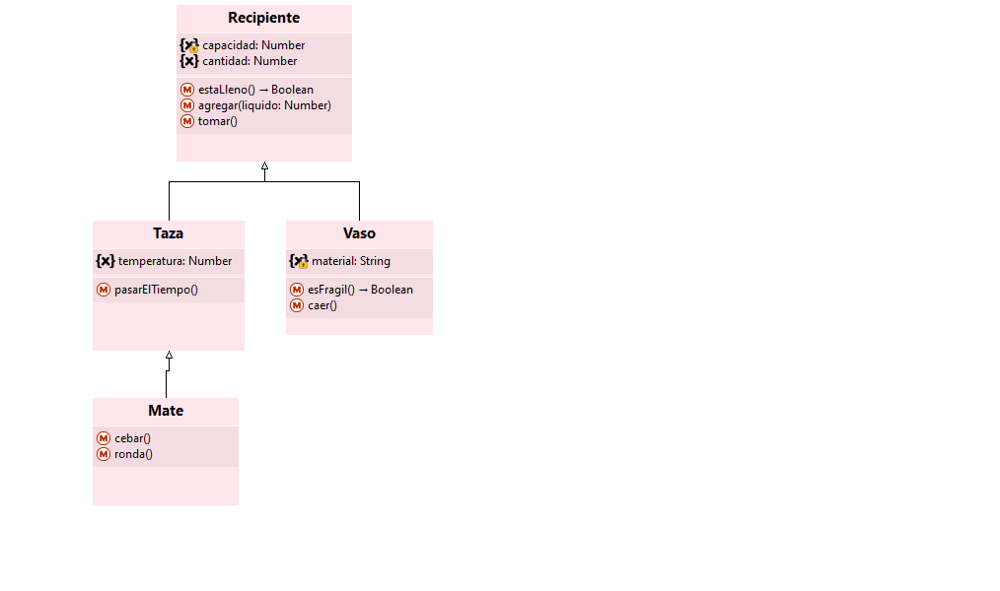

# Sobre tazas y otros recipientes

**Ejemplo para explicar Herencia**


### Algo que contiene bebidas calientes (Clase)
Queremos representar muchos objetos similares que sirven para contener líquidos calientes, permiten tomar de ellos o agregar más cantidad. Tienen una cierta capacidad maxima, por lo que podemos saber cuándo están llenos.
También sabemos la temperatura que tiene y a medida que pasa el tiempo su temperatura desciende. 
A esta abstracción decidimos llamarla **Taza** y definir una clase para representarla. 

``` Wollok

class Taza {
  const capacidad = 250 
  var cantidad = 0
  var temperatura //Se debe inicializar al instanciar

  method estaLlena() {
    return cantidad >= capacidad
  }
  method agregar(liquido){
    cantidad += liquido
    // No se controla que la taza rebalse
  }
	
  method tomar(){
    cantidad -= 10  
    //Se considera que cada vez que se toma de a 10 unidades
    //No se controla que no haya suficiente líquido para tomar
  }
  
  method pasarElTiempo(){
    temperatura -= 1
  }
  
  method temperatura() = temperatura 
  // Podría haberse definido como property
	
  method pasarElTiempo(){
    temperatura -= 1
    // Se considera que se disminuye de a uno la temperatura
   }
}
```

### Algo para bebidas frías que puede resultar frágil (Más clases)
Aparecen otros elementos objetos que necesitamos modelar, que también permiten contener líquidos, poder ir agregrando y tomando de ellos, y saber si están llenos teniendo como referencia una capacidad máxima para cada uno.
Como se usan para líquidos fríos no nos interesa representar su temperatura, pero sí es importante conocer de que material están hechos, porque si son de vidrio resultan frágiles y se pueden caer perdiendo todo su contenido.

Si bien en un primer momento podría parecer que la abstraccion de **Taza** nos servía para representarlos (agregar, tomar, capacidad, etc.) vemos que hay caracteristicas definidas que no nos sirven (todo lo referido a temperatura) y hay nuevas características que la solucion anterior no contempla (fragilidad del material).
Utilizando nuevamente el concepto de clase, definimos una nueva a la que llamamos **Vaso**. 

Ya nos empieza a hacer un poco de ruido tener que "copiar y pegar" parte del código...

``` Wollok
class Vaso {
  const capacidad = 250 
  var cantidad = 0
  var material = "vidrio"  //Salvo que se indique lo contrario al instanciar, los vasos son de vidrio 
		
  method estaLleno() {
    return cantidad >= capacidad
  }
  method agregar(liquido){
    cantidad += liquido
    // No se controla que la taza rebalse
  }
	
  method tomar(){
    cantidad -= 10  
    //Se considera que cada vez que se toma de a 10 unidades
    //No se controla que no haya suficiente líquido para tomar
  }
  
  method esFragil(){
    return material == "vidrio"
  }	
  
  method caer(){
    if (self.esFragil()){
      cantidad = 0
    }
  }
}
```

### No se puede tomar si no hay líquido (Herencia) 
Aparece un nuevo requerimiento que es el control de la cantidad restante a la hora de tomar. Cuando ya no hay liquido no se puede tomar y se debe lanzar una excepción.
Pero si tiene algo de líquido, aunque sea una cantidad menor que lo habitualmente se toma, se toma todo lo que queda. 

Y lo más importante: Nos aclaran que esto sucede tanto para los vasos como para las tazas.

La solución pasa por modificar el método tomar, haciendo algo así

```wollok
  method tomar(){
    if(cantidad <= 0) {
      throw new Exception(message= "No hay suficiente líquido para tomar")
    }
    cantidad -= 10
    cantidad = cantidad.max(0)
  }
```
¡Pero habría que hacer lo mismo tanto en Taza como en Vaso!

Ya había sido molesto inicialmente tener que definir dos veces buena parte del código. Ahora tener que modificar dos veces lo mismo es doblemente preocupante, no sólo por lo incómodo sino por la posibilidad que nos equivoquemos y quede distinto.

La solución consiste en incorporar el concepto de **herencia** y definir una nueva abstracción, una entidad más genérica que abarque tanto tazas como vasos. 
Elegimos el término **recipiente** para representar esta idea. Podríamos haber elegido un término más descriptivo como "recipiente que sirve para tomar", pero para que no sea tan extenso nos quedamos con el anterior.

Los atributos y métodos en común los definimos en la clase Recipiente y el cambio del método ´tomar()´ lo hacemos una sola vez.

``` wollok
class Recipiente{
  const capacidad = 250
  var cantidad = 0
  
  method estaLleno() {
    return cantidad >= capacidad  // Detalle: unificamos el género
  }
	
  method agregar(liquido){
    cantidad += liquido
  }
  
  method tomar(){
    if(cantidad <= 0) {
      throw new Exception(message= "No hay suficiente líquido para tomar")
    }
    cantidad -= 10
    cantidad = cantidad.max(0)
  }
```

Ahora, la clases Taza y Vaso *heredan* de la clase Recipiente y se define en ellas sólo lo diferente. 

```wollok
class Taza inherits Recipiente{
  var temperatura 
  
  method pasarElTiempo(){
    temperatura -= 1
  }
  
  method temperatura() = temperatura
}

class Vaso inherits Recipiente{
  var material = "vidrio"  //Salvo que se indique lo contrario al instanciar, los vasos son de vidrio
  
  method esFragil(){
    return material == "vidrio"
  }
  
  method caer(){
    if (self.esFragil()){
      cantidad = 0
    }
  }
}
```

### ¡A tomar unos mates! (Más Herencia)

Surgen nuevos elementos a representar. Se trata de algo que contiene líquido y se toma de él. Cuando se quiere tomar y no hay líquido, debe controlarlo. Nos interesa representar su temperatura y sabemos que se enfría con el paso del tiempo.

Se le llama cebar a agregarle una cierta cantidad de líquido y se permite compartirlo en una ronda de amigos (Al menos, cuando no hay cuarentena...)

En términos del dominio lo denominaríamos "mate", pero ¿como lo representamos en nuestro modelo?.
En primer lugar, la definición de recipiente nos sirve, pero no es suficiente. Si seguimos analizando, vemos que la de Vaso no nos ayuda; la de Taza sí, todo lo que define nos viene bien, pero sigue habiendo cosas que faltan.

Como ninguna de las definiciones existentes se ajusta totalmente a lo que necesitamos, difinimos una nueva clase y la llamamos **Mate**, como nos imaginábmos. 

Lo interesante es utilizar el concepto de Herencia, para que la nueva clase tenga la definición mínima y *herede* lo más posible de las clases existentes. Por lo analizado anteriormente, la clase de la cual conviene que herede es Taza.
Es discutible si los términos elegidos son los más expresivos, tal vez decir que "un mate es como un taza que ..." no sea lo más exacto, pero si le tuvieramos que explicar a un extranjero qué es un mate tal vez la noción de taza nos ayude. 
Podría ser conveniente renombrar Taza por algo como "Recipiente para bebidas calientes" pero para simplificar lo dejamos así. 

```wollok
class Mate inherits Taza{
  
  method cebar(){
    self.agregar(100) // Asumimos que se ceba de a 100 unidades
  }
  
  method ronda(){
    // No tenemos el detalle de cómo es una ronda de mate. En otro momento se lo definirá.
  }
}
```



### Diferentes formas de llenarse (Redefinición)
Ahora, las tazas se consideran llenas cuando están hasta a 10 unidades de su capacidad máxima.
Y los mates nunca se consideran llenos.

En vez de *heredar* el método `estaLleno()`, lo definimos de una nueva manera en la clase Taza y de una nueva manera en la clase Mate, lo que se denomina **redefinir** o **sobreescribir**. En Vaso no hacemos nada, lo continúa heredando de la clase Recipiente.

```wollok
class Taza inherits Recipientea{
 // todo igual  
  override method estaLleno() {
    return cantidad > capacidad - 10
  }
}

class Mate inherits Taza{
 // todo igual  
  override method estaLleno() {
    return false
  }
}
```

### Al tomar de una taza también se enfría (Super)
En las tazas, cada vez que se toma de ellas, además de lo que ya sabíamos también se enfrían en una unidad. 

Redefinimos el método `tomar()` en al clase Taza porque queremos que haga algo diferente, pero a la vez queremos aprovechar toda la lógica definida en el método `tomar()` de Recipiente y no tener que volver a escribirla.

Para ello, en la redefinición del método, indicamos que primero se ejecute el método de igual nombre en la superclase, para que se realice todo lo que allí está definido, y luego se agrega lo nuevo.

Este cambio también afecta a los mates, por lo que al tomarlos también se van enfriando.

```wollok
class Taza inherits Recipientea{
  // todo igual  
  override method tomar(){
    super()   // Con esta expresión llamamos al método tomar() de la superclase
    self.pasarElTiempo()
  }
}
```

### Una taza especial (Objetos que heredan)
Aparece una taza que tiene características únicas que la diferencian de las otras, no solo por el valor de sus atributos, sino por su comportamiento.
Tiene una figura que la caracteriza, que la puede hacer divertida, y una capacidad en particular.
Definimos un objeto que herede de una clase. Al hacerlo se especifican sus atributos y métodos nuevos como en toda definición de herencia y se le da valores iniciales a todos los atributos que hereda, de manera similar a cuando se instancia una clase.

```wollok
object tazaVader inherits Taza(temperatura = 60,capacidad = 300) { 
  var property dibujo = "soy tu padre"
  
  method esDivertida() {
    return dibujo.contains("padre")
  }
}
```


### ¿Otros recipientes?  (Clase abstracta)
En este contexto, tiene sentido preguntarse si hay otros recipientes además de tazas, vasos, mates y la taza vader. En caso afirmativo, si no hay nada en particular en ellos que implique la definición de nuevas entidades, podrían ser simplemente instancias de la clase Recipiente y no habría que modificar el código en absoluto.

Pero también podría suceder que no haya otros elementos por fuera de los mencionados y que la clase Recipiente nunca se intancie, sino que sólo se haga `new()` de sus subclases. 
En este caso, se la denomina **Clase abstracta**

Aparece un nuevo requerimiento que consiste en vaciar cualquier recipiente, pero que se realiza de diferente manera según cuál sea. Cuando se vacía una taza queda sin líquido y vuelve a temperatura ambiente. En los vasos dependiendo de si es fragil, queda un pequeño resto. Vacir un mate, podría ser como toda taza e implicar algo más. 

Sin mayor dificultad, definimos un método `vaciar()` con su propia implementación en cada una de las clases. ¿Y qué hacemos en la clase Recipiente?

Si la clase no es abstacta, como se pide que todo recipiente se puede vaciar, se debería definir también en ella el método `vaciar()` con su correspondiente implementación.
Pero en caso que sea abstracta no sería necesario definirlo, ya que no van a existir objetos de esa clase que reciban el mensaje. 


### Una merienda (Método abstracto)

Un nuevo requerimiento nos plantea que se puede hacer una merienda con cualquiera de los recipientes, que consiste en agregarle líquido al recipiente, en caso que no esté lleno, luego tomar varias veces y por úlitmo vaciarlo. 
Lo que puede constatarse es que más allá que sea igual o diferente la manera en que se agregue líquido, se tome o se vacíe una taza, vaso, mate u otro recipiente, lo cierto es que la secuencia de la merienda es la misma en todos los casos, por lo que decidimos modelarla en la clase Recipiente, independientemente que sea abstracta o no.  

``` wollok
class Recipiente {
  //todo igual
  
  method realizarMerienda(){
    if(!self.estaLleno())
      self.agregar(250)
    5.times{x=>self.tomar()}
    self.vaciar()
  }
}
```

Cualquiera de los objetos de las subclases, cuando reciben el mensaje `realizarMerienda()`, como en su propia clase no está definido, encuentran este código en su superclase Recipiente. Al ejecutarlo, cuando se envían a si mismo los otros mensajes, buscan el código correspondiente empezando siempre por su propia clase.
Por ejemplo, en el caso de `estaLleno()` como está redefinido y hay diferentes implementaciones, cada uno lo encuentra en su clase. En el caso de `agregar(cantidad)` no lo tienen en su propia clase pero lo buscan en su superclase. 

En el caso que la clase Recipiente no sea abstracta, el método `vaciar()` tendrá su implementación. Cuando un objeto que es instancia de Recipiente reciba en mensaje, siempre comenzará la busqueda del métodos en dicha clase. 

En el caso que Recipiente sea abstracta, como en el código se llama al método `vaciar()` con `self` como receptor, se debe declarar dicho método pero se lo hace como **método abstracto**.

Se indica sólo el nombre del método, los parámetros si tuviera, y sin las { } ni nada de código. Esto asegura que en las subclases (no abstractas) se deba tener una implementación de dicho método.

```wollok

class Recipiente {
  //Todo igual
  method vaciar() // Método abstracto
}
```

### Diagrama estático


